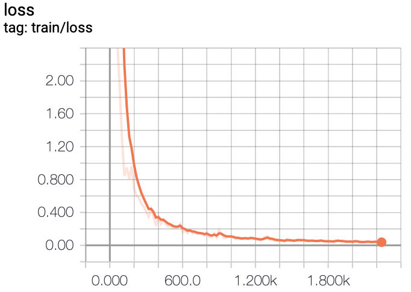
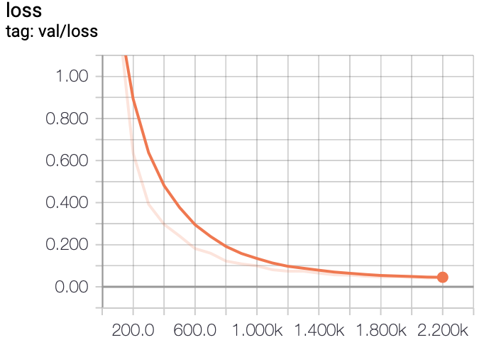
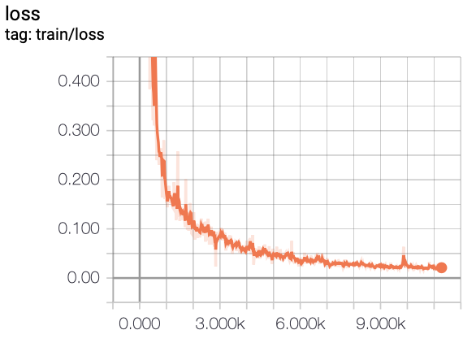
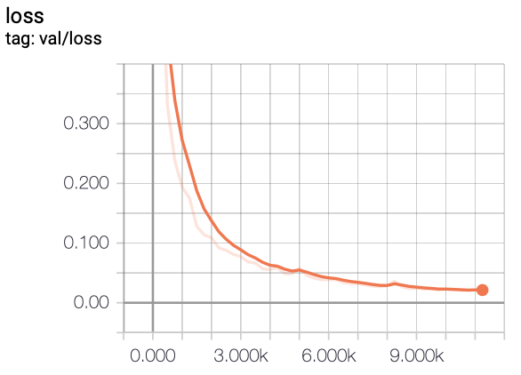
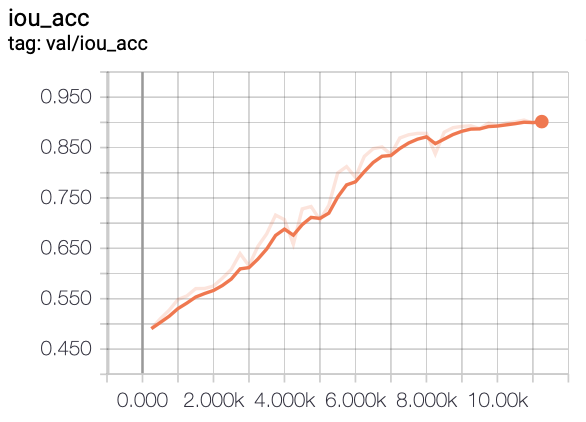

# Fully Convolutional Networks for Liver Segmentation

In this project, we experiment with training FCN models on a liver segmentation dataset provided by [IRCAD](https://www.ircad.fr/research/computer/)

## Set up
First, we need to set up a virtual `Python 3.6` environment as follows
```bash
pip install virtualenv
virtualenv -p python3 .env
source .env/bin/activate
pip install -r requirements.txt
```
## Download data
Then, download the dataset `3D-ircadb-01` by running the script below
```bash
sh scripts/download.sh
```

## How to run
### Preprocessing
The image format in the dataset is in `DICOM` format so we have to do some preprocessing stuff before converting data to `TFRecord` format for later training in `TensorFlow`.

In the scope of this project, we only segment 4 classes including `liver`, `bone`, `kidney` and `others`. Therefore, each preprocessed data sample will be a pair of
* an `image` - an input image of shape (512, 512) and
* a `mask` - a 2D array has the same spatial shape as the `image` indicating which class each pixel belongs to.
```bash
python run.py --mode preprocess
```
We use `TensorFlow` iterator to iterate over the dataset. To check `image` and `mask` shape, run the command below
```bash
python run.py --mode iter
```
### Training
To train FCN models with default config, run
```bash
python run.py --mode train
```
### Prediction
To predict output on the validation set, run
```bash
python run.py --mode predict
```


### TensorBoard
#### No augmentation

<p float="left">
  
   
  
</p>

#### With augmentation

<p float="left">
  
   
  
</p>

## TODOs
- [x] Preprocessing
- [x] Building model
- [x] Training pipeline
- [x] Augmentation
- [x] Visualization
- [x] TensorBoard

**References**
1.  Long et al. , Fully Convolutional Networks for Semantic Segmentation. ([arxiv](https://arxiv.org/pdf/1411.4038.pdf))